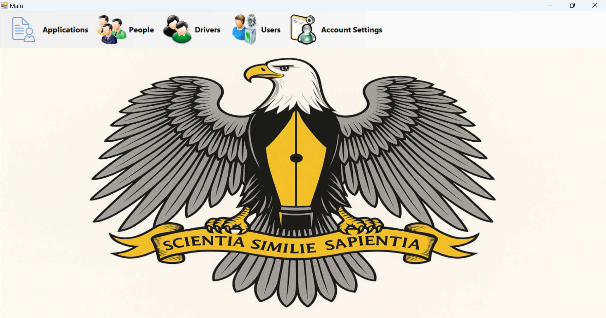

# 🪪 DVLD - Driving & Vehicle License Department

> **A comprehensive enterprise-level desktop application that automates the management of driving licenses, tests, and vehicle registrations.**

---

### 📸 Screenshots

  

---

### 🛠️ Tech Stack
* **Language:** C#
* **Framework:** .NET Framework
* **Database:** MS SQL Server (Complex Schema & Stored Procedures)
* **Architecture:** 3-Tier Architecture (Presentation, Business Logic, Data Access)

---

### 🚀 System Modules
This system simulates a real-world government workflow including:

* **📑 Application Management:** Handling new local and international driving license applications.
* **📝 Testing Center:** Scheduling Vision, Theory, and Practical tests and recording results.
* **💳 License Issuance:** Issuing, renewing, and replacing lost/damaged licenses.
* **🚫 Detain & Release:** Managing detained licenses and handling fines.
* **👥 User Management:** Admin dashboard to manage system users and permissions.

---

### 💡 Technical Highlights
* **Solid Architecture:** Separated logic into Data Access Layer (DAL) and Business Logic Layer (BLL).
* **Data Integrity:** Extensive use of SQL constraints and relationships.
* **User Experience:** Intuitive WinForms design with validation and error handling.

---

### 👤 Author
**Wali al-Din**
* [GitHub Profile](https://github.com/wliaal-din-code)
